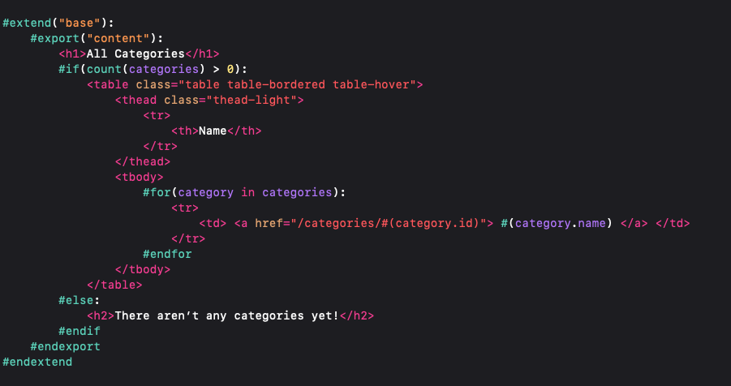
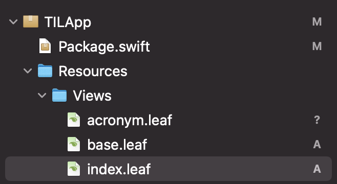
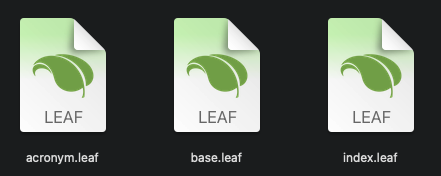

# Vapor Leaf Language Support for Xcode

This adds Vapor Leaf language support to Xcode IDE via a Xcode plugin and language support files providing syntax highlighting for Vapor Leaf tags and HTML tags with auto-indentation that works in tandem for both.  



## File icons

Use my previous [solution](https://github.com/OmranK/LeafSyntaxHighlighter) to add custom file icons for .leaf files.

 &nbsp;




## Supported Xcode Versions

This version works with Xcode 12. With future verisons, the plugin's Info.plist needs to be updated to include the new DVTPlugInCompatibilityUUID in the Info.plist of the new Xcode version.

## Script Install

The fastest way to install is to run `install.sh` script file. To do so, `cd` into the project directory and run the following command in your terminal :

```
sudo sh install.sh
```

Once the setup script has finished, restart Xcode and click the "Load bundle" button in the prompt that appears when Xcode starts.

## Manual Install

Copy the `Leaf.xclangspec` file to `/Applications/Xcode.app/Contents/SharedFrameworks/SourceModel.framework/Versions/A/Resources/LanguageSpecifications`
```
sudo cp Leaf.xclangspec /Applications/Xcode.app/Contents/SharedFrameworks/SourceModel.framework/Versions/A/Resources/LanguageSpecifications
```

Copy the `Xcode.SourceCodeLanguage.Leaf.plist` file to `/Applications/Xcode.app/Contents/SharedFrameworks/SourceModel.framework/Versions/A/Resources/LanguageMetadata`
```
sudo cp Xcode.SourceCodeLanguage.Leaf.plist /Applications/Xcode.app/Contents/SharedFrameworks/SourceModel.framework/Versions/A/Resources/LanguageMetadata
```

Copy the `Leaf.ideplugin` directory to `~/Library/Developer/Xcode/Plug-ins/`\
Note that the `Plug-ins`  directory might not exist, and if it doesn't, you need to create one
```
cp -r Leaf.ideplugin ~/Library/Developer/Xcode/Plug-ins/
```
Then, restart Xcode and click the "Load bundle" button in the prompt that appears when Xcode starts.


## Uninstall

You can delete all the files from their directories or just run the `uninstall.sh` script file. To do so, `cd` into the project directory and run the following command in your terminal :

```
sudo sh uninstall.sh
```
